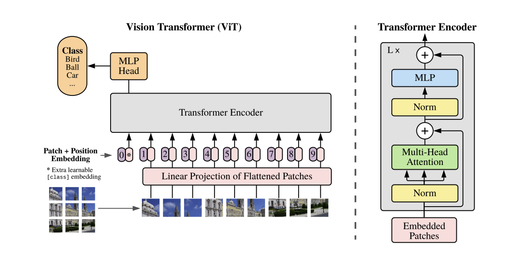

# Vision Transformer

## Architecture


[An Image is Worth 16x16 Words: Transformers for Image Recognition at Scale](https://arxiv.org/abs/2010.11929)


## Stack
<p style="display: inline">
  
  
</p>

## Environment
| Language  | version |
| --------------------- | ---------- |
| Python                | 3.10.11    |

その他のパッケージのバージョンは pyproject.toml と package.json を参照してください


## Command
> Train
```
git clone git@github.com:hanoi0126/vision-transformer.git
cd vision-transformer
```

```
docker build -t vit:v1.0 .
docker run -it --gpus all -v $PWD:workspace vit:v1.0 /bin/bash
```

```
bash train.sh
```